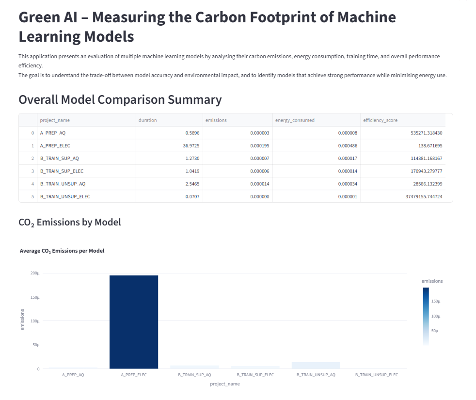
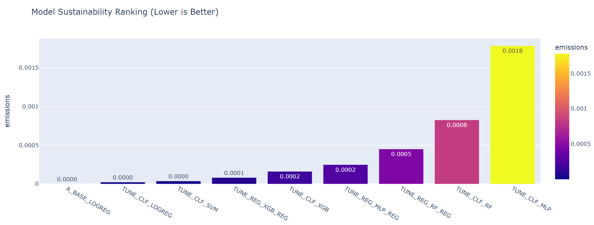
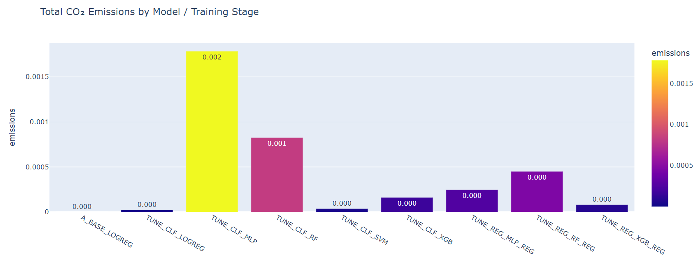

# Green AI Benchmark: Carbon-Aware Machine Learning Evaluation Framework

This repository contains the full implementation of my MSc Research Thesis:

**“Green AI: Quantifying the Carbon Footprint of Machine Learning Models Through Multi-Model Energy Benchmarking and Emissions Analysis.”**

This project develops a structured and reproducible benchmarking framework that evaluates classical machine learning models not only by predictive performance, but also by runtime efficiency, energy consumption, and carbon emissions using CodeCarbon.

Developed as part of my MSc in Data Analytics at the National College of Ireland (2026), under the supervision of Prof. Sallar Khan.

---

## Overview

Traditional machine learning evaluation prioritizes predictive metrics such as accuracy, F1-score, or mean absolute error. However, the growing computational demands of AI systems have raised significant sustainability concerns. While large-scale deep learning systems have received attention for their environmental impact, comparatively limited empirical work evaluates the carbon footprint of classical machine learning models under controlled experimental settings.

This thesis addresses that gap.

Rather than asking only *“Which model performs best?”*, this framework asks:

> How do different machine learning algorithms compare when evaluated simultaneously on predictive performance, runtime, energy consumption, and carbon emissions?

The objective is not merely to measure emissions, but to integrate environmental accountability directly into the model evaluation process.

The system combines:

- Data preprocessing and feature engineering  
- Supervised classification and regression  
- Unsupervised clustering  
- Real-time carbon tracking via CodeCarbon  
- Statistical runtime–emissions analysis  
- Sustainability ranking and efficiency scoring  
- An interactive Streamlit dashboard for decision support  

All experiments were conducted under identical hardware conditions to ensure fair comparison and reproducibility.

---

## Experimental Datasets

### Air Quality Dataset (Classification)

The Air Quality UCI dataset consists of over 9,000 hourly pollutant measurements, including CO, NO₂, NOx, benzene concentrations, and meteorological variables.

For this project:

- The CO(GT) variable was converted into a binary classification task (high vs low pollution levels).
- Feature engineering included time-based indicators, lag features, and rolling statistical summaries.
- The task evaluates how different algorithms handle nonlinear pollutant interactions while tracking their environmental cost.

This dataset enables evaluation of model sustainability in environmental monitoring applications.

---

### Electricity Consumption Dataset (Regression)

Monthly electricity consumption data was used to evaluate forecasting performance under time-series conditions.

For this dataset:

- Lag features (1, 3, 6, 12 months) were generated to capture seasonality and temporal dependencies.
- Timestamp redundancies were removed.
- Models were evaluated using Mean Absolute Error (MAE) and residual analysis.

This dataset allows investigation of predictive efficiency and computational trade-offs in energy demand forecasting.

---

## Models Implemented

To ensure methodological diversity, models were selected across linear, ensemble, kernel-based, and neural architectures.

### Supervised Classification

- Logistic Regression — baseline linear classifier with minimal computational complexity.
- Random Forest — ensemble method capturing nonlinear interactions through decision-tree aggregation.
- Support Vector Machine (RBF kernel) — kernel-based classifier modelling complex decision boundaries.
- XGBoost — gradient boosting framework emphasizing high predictive accuracy.
- Multilayer Perceptron (MLP) — neural network capturing deep nonlinear relationships.

---

### Supervised Regression

- Random Forest Regressor  
- XGBoost Regressor  
- MLP Regressor  

These models enable comparison of ensemble, boosting, and neural forecasting approaches under carbon tracking.

---

### Unsupervised Learning

- K-Means  
- Gaussian Mixture Model  
- Agglomerative Clustering  
- DBSCAN  
- Principal Component Analysis (PCA)  

These methods were evaluated for structural pattern discovery while measuring computational footprint.

---

## Carbon Emissions Measurement Framework

Carbon emissions were estimated using CodeCarbon, which tracks hardware energy consumption and applies regional carbon intensity factors.

The emissions calculation follows:

CO₂ (kg) = Energy Consumed (kWh) × Carbon Intensity (kgCO₂eq/kWh)


Energy consumption was estimated as:

Energy (kWh) = (CPU Power + RAM Power) × Runtime (hours)


All experiments were conducted on:

- Intel i5-1335U (CPU-only)
- 15.7GB RAM
- Ireland regional carbon intensity factor

The controlled setup ensured consistent benchmarking and eliminated hardware variability as a confounding factor.

---

## Statistical Validation of Emissions

To rigorously validate environmental behavior, statistical tests were performed on the emissions dataset.

A Pearson correlation test between runtime and CO₂ emissions revealed:

- Correlation coefficient (r) = 1.000  
- p-value ≈ 0  

This indicates a perfect positive linear relationship between runtime and emissions.

An Ordinary Least Squares regression further confirmed:

- R² = 1.000  
- Runtime as a statistically significant predictor of CO₂ emissions  

These findings demonstrate that, under CPU-based experimentation, runtime is the primary driver of carbon cost, empirically validating the theoretical energy-emissions relationship.

---

## Key Findings

The results provide several important insights into sustainability-aware machine learning evaluation.

First, predictive accuracy alone is insufficient as a model selection criterion when environmental cost is considered. While XGBoost and Random Forest frequently achieved the highest predictive scores, their carbon emissions were significantly higher than lightweight models.

Second, Random Forest emerged as the strongest balance between predictive performance and sustainability. It consistently delivered high accuracy while maintaining moderate carbon cost relative to boosting and neural approaches.

Third, Multilayer Perceptron models produced the highest emissions per accuracy point. Although capable of modelling nonlinear relationships, their iterative optimization substantially increased runtime and energy consumption without proportionate performance gains.

Fourth, lightweight models such as Logistic Regression and K-Means produced negligible emissions while still delivering meaningful analytical insights. This finding is especially relevant for resource-constrained or climate-sensitive applications.

Fifth, unsupervised learning methods demonstrated strong exploratory value at near-zero carbon cost. K-Means, in particular, achieved meaningful clustering structure while maintaining extremely low computational overhead.

Finally, sustainability ranking clearly demonstrates that higher algorithmic complexity does not necessarily imply responsible environmental performance.

---

## Dashboard

An interactive Streamlit dashboard consolidates all modelling and emissions results into a unified sustainability evaluation interface.

The dashboard enables:

- Real-time comparison of CO₂ emissions across models  
- Visualization of CPU vs RAM energy contribution  
- Emissions-per-accuracy efficiency scoring  
- Sustainability ranking (lower emissions = higher sustainability)  
- Parallel-coordinates multi-metric comparison  

This interface transforms carbon metrics into a practical decision-support system for sustainability-aware model selection.

---

## Reproducibility

All experiments were conducted:

- On identical hardware  
- Under CPU-only conditions  
- Using consistent train–test splits  
- With documented hyperparameters  
- With emissions logged per training run  

All thesis figures can be regenerated using the notebooks provided in this repository.

---

## 📊 Dashboard & Analysis Preview

The Green AI Sustainability Dashboard provides an interactive interface to evaluate machine learning models across predictive performance, runtime, energy consumption, and carbon emissions. The dashboard transforms emissions tracking into a decision-support framework for sustainability-aware model selection.

---

### 🖥 Overall Model Comparison Summary

This consolidated dashboard view presents duration, total CO₂ emissions, total energy consumption, and calculated efficiency scores across all experimental runs.



---

### 🌍 CO₂ Emissions by Model

This visualization compares the total carbon footprint generated by each model during training, highlighting the disparity between lightweight and computationally intensive approaches.


---

### ⚡ Energy Efficiency — CO₂ Emissions per Accuracy Point

This metric normalizes emissions by predictive accuracy, enabling fair sustainability comparison across models.


---

### 🔋 Total Energy Consumption (CPU + RAM)

This stacked chart decomposes total energy usage into CPU and RAM contributions.


---

### 🏆 Model Sustainability Ranking

Models are ranked by total carbon emissions, where lower emissions indicate higher sustainability.



---

### 🌱 Total CO₂ Emissions by Training Stage

This plot separates emissions generated during preprocessing and model training stages.



---

### 📈 Sustainability Parallel Coordinates Analysis

This multi-metric visualization enables simultaneous comparison of emissions, CPU power, RAM power, and runtime across all experimental runs.


## Running the Project

1. Install dependencies:

```bash
pip install -r requirements.txt

## Running the Project

To reproduce the full experimental pipeline and regenerate all modelling, emissions tracking, and statistical analysis results included in the thesis, first ensure that all dependencies listed in `requirements.txt` are installed in your Python environment.

### Launch Jupyter Notebooks

From the root directory of the repository, start the Jupyter environment:

```bash
jupyter notebook
```

Navigate to the `notebooks/` directory and execute the notebooks sequentially to reproduce:

- Data preprocessing and feature engineering  
- Supervised classification experiments  
- Regression modelling  
- Unsupervised clustering analysis  
- Carbon emissions tracking via CodeCarbon  
- Statistical runtime–emissions validation  

All figures presented in the thesis can be regenerated from these notebooks and the stored emissions logs.

---

### Run the Sustainability Dashboard

To launch the interactive Streamlit dashboard for real-time sustainability evaluation and model comparison:

```bash
streamlit run dashboard/streamlit_app.py
```

The dashboard provides:

- Comparative CO₂ emissions visualization  
- Runtime analysis across models  
- CPU and RAM energy contribution breakdown  
- Emissions-per-accuracy efficiency scoring  
- Sustainability ranking across all experiments  
- Multi-metric parallel coordinates comparison  

The interface is designed as a decision-support system to visualize predictive performance alongside environmental cost in a unified analytical framework.

---

## Citation

If you use this framework in academic research, sustainability benchmarking, or applied machine learning evaluation, please cite:

```
Lakshmi Meena Manivannan (2026).
Green AI: Quantifying the Carbon Footprint of Machine Learning Models Through Multi-Model Energy Benchmarking and Emissions Analysis.
MSc Research Practicum, National College of Ireland.
```

---

## Remarks

This project integrates predictive analytics with environmental accountability by embedding carbon emissions measurement directly into the machine learning training pipeline. Rather than treating sustainability as a secondary metric, it operationalizes carbon tracking as a core evaluation dimension.

The study demonstrates a statistically validated runtime–emissions relationship, empirically confirming runtime as the primary driver of carbon cost in CPU-based experimentation. Through Pearson correlation and regression analysis, emissions were shown to scale linearly with training duration under controlled hardware conditions.

Additionally, the framework introduces a structured sustainability ranking methodology that enables comparison of models based not only on predictive strength but also on environmental efficiency. This shifts the evaluation paradigm from accuracy-only benchmarking to performance–efficiency trade-off analysis.

Future work includes extending the framework to GPU-based experimentation, benchmarking under distributed and cloud-scale environments, and integrating automated carbon-aware hyperparameter optimization to further advance sustainable AI research.
